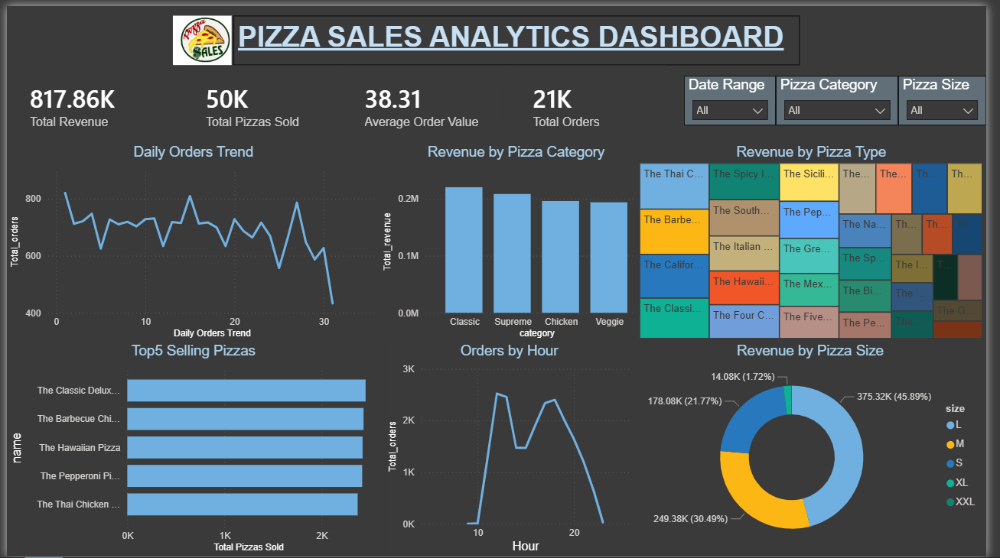
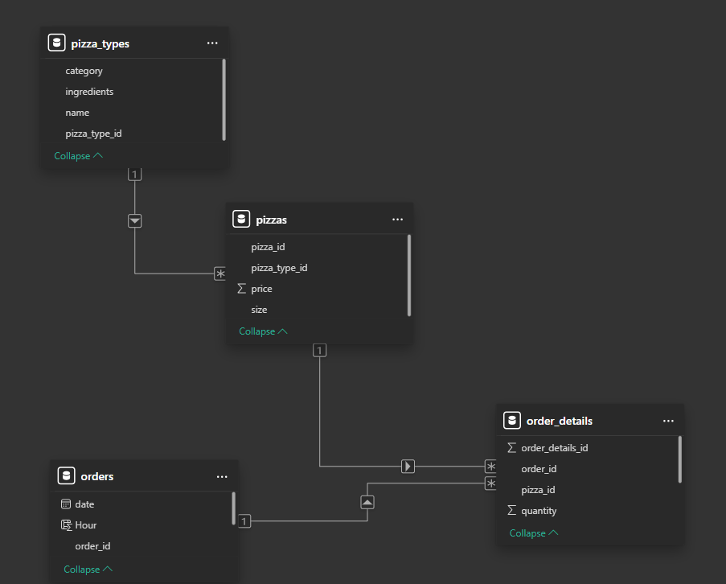

# 🍕Pizza Sales Analysis📈 - using SQL & POWER BI

An end-to-end Data Analytics project that analyzes pizza sales data to uncover meaningful business insights using SQL and Power BI.
The project focuses on sales trends, customer ordering behavior, revenue analysis, and product performance through data-driven decision-making.

---

## 📌Project Overview

The objective of this project is to perform business-oriented data analysis on a pizza sales dataset and answer real-world analytical questions using SQL. The insights generated help understand customer preferences, identify top-performing products, and analyze sales performance across different dimensions.

This project demonstrates practical skills in:

- SQL Query Writing
- Data Analysis
- Relational Database Management
- Business Intelligence
- Data Visualization
- Dashboard Development
- Analytical Thinking
- Business Insight Generation

---

## 🛠️Tools & Technologies Used

- SQL
- Power BI
- Microsoft Excel
- Git & GitHub

---

## ✍🏻Skills Demonstrated

- SQL for Data Analysis
- Data Cleaning and Exploration
- Relational Database Analysis
- Power BI Dashboard Development
- Business Analytics
- Data Visualization
- Problem Solving
- Analytical Thinking

---

## 📊Dashboard Preview

<p align="center">
  
  <br>
  <em>Interactive Power BI Dashboard showing sales trends, revenue analysis, and business insights.</em>
</p>

## 💾Database Schema

<p align="center">
  
  <br>
  <em>Relational database model used for SQL-based sales analysis.</em>
</p>

---

## 🪫Business Problem Statement

A pizza company wants to analyze its sales performance to answer questions such as:

- Which pizzas generate the highest revenue?
- What are the peak ordering hours?
- Which pizza categories and sizes are most popular?
- How many orders are placed over time?
- What are the customer purchasing patterns?

Using SQL and Power BI, these business questions were answered through data analysis and interactive visualizations.

---

## 💾Dataset Information

The dataset consists of four relational tables:

| Table Name | Description |
|-----------|------------|
| Orders | Stores order date and time information |
| Order Details | Stores pizza quantities for each order |
| Pizzas | Stores pizza size and pricing details |
| Pizza Types | Stores pizza names, categories, and ingredients |

The relationships between these tables were used to perform SQL joins and analytical queries.

---

## 📝SQL Concepts Used

This project demonstrates practical implementation of:

- SELECT Statements
- Aggregate Functions
- GROUP BY
- ORDER BY
- WHERE Clause
- JOINS
- Subqueries
- Common Table Expressions (CTEs)
- Filtering and Sorting
- Revenue Calculations
- Business Metrics Analysis

---

## 📰Key Performance Indicators (KPIs)

The dashboard includes the following KPIs:

- Total Revenue
- Total Orders
- Total Pizzas Sold
- Average Order Value

---

## 📈Dashboard Features

The interactive Power BI dashboard provides:

- Revenue Analysis by Pizza Category
- Top Selling Pizza Analysis
- Revenue Distribution by Pizza Size
- Orders by Hour Analysis
- Daily Order Trends
- Revenue Contribution by Pizza Types
- Interactive Filters and Slicers

Users can dynamically filter the dashboard using:

- Pizza Category
- Pizza Size
- Date Range

---

## 👁️‍🗨️Key Insights
        <ul>
            <li><strong>Total Revenue:</strong> The business generated <strong>$817.86K</strong> in revenue from over <strong>21K customer orders</strong>, demonstrating strong overall sales performance.</li>
            <li><strong>Customer Demand:</strong> More than <strong>50K pizzas</strong> were sold, indicating consistent customer demand across multiple product categories.</li>
            <li><strong>Average Order Value:</strong> Customers spent an average of <strong>$38.31 per order</strong>, providing a benchmark for future pricing and promotional strategies.</li>
            <li><strong>Top Revenue Category:</strong> The <strong>Classic Pizza category</strong> generated the highest revenue, followed closely by Supreme and Chicken categories.</li>
            <li><strong>Most Popular Pizza:</strong> <strong>The Classic Deluxe Pizza</strong> emerged as the best-selling product based on total units sold.</li>
            <li><strong>Peak Ordering Hours:</strong> Order volume peaked during lunch and evening hours, with the highest activity observed between <strong>12 PM–1 PM</strong> and <strong>5 PM–7 PM</strong>.</li>
            <li><strong>Pizza Size Preference:</strong> <strong>Large-sized pizzas</strong> contributed nearly <strong>46% of total revenue ($375.32K)</strong>, making them the most profitable size segment.</li>
            <li><strong>Sales Trend:</strong> Daily orders remained relatively stable throughout the month, averaging between <strong>650–800 orders per day</strong>, indicating consistent customer engagement.</li>
            <li><strong>Revenue Concentration:</strong> A small group of top-performing pizza varieties contributed a significant portion of overall revenue, highlighting opportunities for targeted promotions and inventory optimization.</li>
        </ul>  
---
## 📝Business Recommendations
  <ul>
        <li>Increase inventory allocation and promotional focus on the Classic category, as it generates the highest revenue.</li>
        <li>Introduce premium combo offers centered around Large-sized pizzas to maximize average order value.</li>
        <li>Schedule additional staff during peak lunch and evening hours to improve service efficiency and reduce wait times.</li>
        <li>Develop marketing campaigns around best-selling products such as The Classic Deluxe Pizza to increase repeat purchases.</li>
        <li>Use sales trend insights to forecast demand more accurately and optimize inventory planning.</li>
        <li>Monitor lower-performing pizza varieties and evaluate promotional strategies to improve their contribution to overall revenue.</li>
    </ul>
---

## 🔍Project Structure

```
Pizza-Sales-Analysis
│
├── Pizzasales_Dataset
|     ├── order_details.csv
│     ├── orders.csv
|     ├── pizza_types.csv
│     └── pizzas.csv
│
├── SQL_Queries
│
├── PowerBI_Dashboard
│     ├── Dashboard.pbix
│     ├── dashboard.png
│     ├── modelview.png
│     └── project_modelview.pbix
│
├── Screenshots
│     ├── dashboard.png
│     ├── table1.png
│     ├── table2.png
│     ├── table3.png
│     └── table4.png
│
├── PPT
│     └── Pizza_Sales_Analysis_Presentation.pdf
│
└── README.md
```

---

## 📑Learning Outcomes

Through this project, I gained hands-on experience in:

- Writing analytical SQL queries.
- Working with relational datasets.
- Building interactive Power BI dashboards.
- Generating business insights from raw data.
- Presenting analytical findings effectively.

---

## 🔜Future Scope

This project can be further enhanced by:

- Building predictive sales models.
- Performing customer segmentation analysis.
- Developing real-time sales dashboards.
- Integrating machine learning techniques for sales forecasting.

---

## 👩🏻‍💻Author
Manya Mishra

MCA (Artificial Intelligence & Machine Learning)
Aspiring Data Analyst/Scientist | Python | SQL | Power BI | Data Analytics

---

## 🙇🏻‍♀️Thank You

If you found this project interesting, feel free to explore the repository and connect with me.
